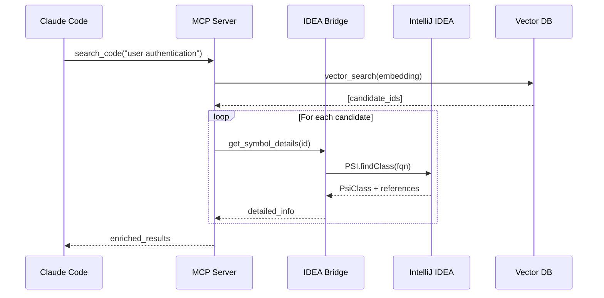

# IDEA-Enhanced-Context MCP Server
## 技术设计文档 v1.0

**项目背景**：为拥有大规模Java代码库的企业（如上万个仓库、数百个微服务）提供基于IntelliJ IDEA语义索引的高质量代码上下文检索能力。

---

## 1. 问题定义与价值主张

### 1.1 现有方案的局限性

**claude-context MCP**（当前开源方案）：
- 使用通用AST parser（tree-sitter等）
- 对静态类型语言（Java/Kotlin）的类型推导能力有限
- 无法利用IDEA已构建的完整语义索引
- 跨文件引用分析质量不如IDE

**痛点**：
```java
// 场景：查找某个接口的所有实现
public interface UserService {
    User findById(Long id);
}

// claude-context: 只能通过文本匹配找到 "implements UserService"
// IDEA语义索引: 知道完整继承树、调用链、依赖关系
```

### 1.2 价值主张

**对于企业级Java开发**：
- ✅ **更精确的符号解析**：利用IDEA的类型系统和引用索引
- ✅ **零重复索引**：IDEA已经索引好了，不需要重新构建AST
- ✅ **实时同步**：代码修改时IDEA索引自动更新
- ✅ **大规模支持**：IDEA天生为大型项目优化
- ✅ **跨模块分析**：Maven/Gradle多模块项目的完整依赖图

**Token节约潜力**：
- claude-context: ~40% token减少
- **idea-enhanced-context**: 预期 50-60% token减少（更精确的检索 = 更少的噪声）

---

## 2. MVP验证计划

### 2.1 阶段0：技术可行性验证（1-2周）

**目标**：验证核心技术栈的可行性

#### 验证项1：JetBrains Platform SDK访问能力
```kotlin
// 测试：能否在MCP Server中访问IDEA的PSI
@Test
fun `can access PSI from external process`() {
    val project = ProjectManager.getInstance().openProject(...)
    val psiFile = PsiManager.getInstance(project).findFile(virtualFile)
    val javaFile = psiFile as PsiJavaFile
    val classes = javaFile.classes
    // 验证能否序列化为JSON返回
}
```

**成功标准**：
- ✅ 能够从独立进程访问IDEA PSI API
- ✅ 能够查询符号信息（类、方法、字段）
- ✅ 能够获取引用关系（Find Usages）

#### 验证项2：MCP Protocol集成
```typescript
// 测试：构建最简单的MCP Server
import { Server } from "@modelcontextprotocol/sdk/server/index.js";

const server = new Server({
  name: "idea-enhanced-context",
  version: "0.1.0",
}, {
  capabilities: {
    tools: {},
  },
});

// 实现一个测试工具
server.setRequestHandler(ListToolsRequestSchema, async () => ({
  tools: [{
    name: "search_java_class",
    description: "Search for Java classes using IDEA index",
    inputSchema: {
      type: "object",
      properties: {
        className: { type: "string" }
      }
    }
  }]
}));
```

**成功标准**：
- ✅ MCP Server能与Claude Code通信
- ✅ 能正确处理search请求并返回结果

#### 验证项3：向量检索整合
```python
# 测试：IDEA符号信息 → Embeddings → Milvus
from pymilvus import connections, Collection
from sentence_transformers import SentenceTransformer

# 1. 从IDEA获取符号信息（JSON）
symbol_info = {
    "type": "class",
    "name": "UserServiceImpl",
    "package": "com.company.service",
    "methods": ["findById", "save", "delete"],
    "implements": ["UserService"],
    "javadoc": "Implementation of user service..."
}

# 2. 生成语义化文本
text = f"""
Class: {symbol_info['name']}
Package: {symbol_info['package']}
Implements: {', '.join(symbol_info['implements'])}
Methods: {', '.join(symbol_info['methods'])}
Documentation: {symbol_info['javadoc']}
"""

# 3. Embedding
model = SentenceTransformer('voyage-code-3')
embedding = model.encode(text)

# 4. 存入Milvus
collection.insert([{
    "id": "com.company.service.UserServiceImpl",
    "vector": embedding,
    "metadata": symbol_info
}])
```

**成功标准**：
- ✅ 能将IDEA符号转化为高质量embeddings
- ✅ 检索精度 > claude-context（用SWE-bench测试）

### 2.2 阶段1：最小可用原型（2-3周）

**功能范围**：
1. 索引单个Java项目（~1000个类）
2. 支持类级别的语义搜索
3. 集成到Claude Code

**架构**：
```
┌─────────────────┐
│  Claude Code    │
└────────┬────────┘
         │ MCP Protocol
┌────────▼─────────────────────────┐
│  idea-enhanced-context           │
│  MCP Server (TypeScript/Node.js) │
└────────┬─────────────────────────┘
         │ HTTP/gRPC
┌────────▼─────────────────────────┐
│  IDEA Index Bridge               │
│  (IntelliJ Plugin - Kotlin)      │
└────────┬─────────────────────────┘
         │ PSI API
┌────────▼─────────────────────────┐
│  IntelliJ IDEA                   │
│  (Running Instance)              │
└──────────────────────────────────┘
         │
┌────────▼─────────────────────────┐
│  Milvus Vector Database          │
└──────────────────────────────────┘
```

**核心组件**：

1. **IDEA Index Bridge** (IntelliJ Plugin)
   - 暴露HTTP/gRPC endpoint
   - 提供PSI查询接口
   - 实时推送索引变更

2. **MCP Server** (TypeScript)
   - 实现MCP协议
   - 调用IDEA Index Bridge
   - 管理向量检索

3. **Indexing Pipeline**
   - 提取符号信息
   - 生成embeddings
   - 批量写入Milvus

### 2.3 阶段2：企业级验证（4-6周）

**测试场景**：
1. 大型monorepo（5000+ classes）
2. Maven多模块项目（50+ modules）
3. 微服务架构（10+ repos同时索引）

**性能基准**：
- 索引速度：>1000 classes/min
- 查询延迟：<200ms (p99)
- 内存占用：<2GB per 10k classes
- 准确率：>85% on Java code comprehension tasks

---

## 3. 技术架构详细设计

### 3.1 组件交互流程



### 3.2 IDEA Index Bridge API设计

```kotlin
// REST API Endpoints

// 1. Symbol查询
@GET("/api/symbols/search")
data class SymbolSearchRequest(
    val query: String,
    val type: SymbolType?, // CLASS, METHOD, FIELD
    val scope: SearchScope  // PROJECT, MODULE, ALL
)

data class SymbolInfo(
    val fqn: String,
    val type: SymbolType,
    val source: SourceLocation,
    val javadoc: String?,
    val references: List<ReferenceInfo>,
    val hierarchy: HierarchyInfo?  // superclass, interfaces, subclasses
)

// 2. 引用分析
@GET("/api/references/{fqn}")
data class ReferenceInfo(
    val location: SourceLocation,
    val context: String,  // 上下文代码片段
    val type: ReferenceType  // READ, WRITE, CALL, INHERIT
)

// 3. 代码导航
@GET("/api/navigation/implementations/{fqn}")
data class NavigationResult(
    val implementations: List<SymbolInfo>,
    val usages: List<UsageInfo>
)

// 4. 增量更新推送
@WebSocket("/api/index/changes")
data class IndexChangeEvent(
    val timestamp: Long,
    val changes: List<FileChange>
)
```

### 3.3 索引策略

**两层索引结构**：

```
Layer 1: Coarse-grained (类级别)
├── Vector: Class semantic embedding
├── Metadata: Package, inheritance, annotations
└── Quick filter

Layer 2: Fine-grained (方法/字段级别)
├── Vector: Method/field embedding
├── Metadata: Parameters, return type, references
└── Triggered on-demand
```

**索引内容设计**：

```typescript
interface ClassIndexEntry {
  // Primary key
  fqn: string;  // "com.company.service.UserServiceImpl"
  
  // Vector
  semantic_vector: number[];  // 768-dim from voyage-code-3
  
  // Structured metadata (for filtering)
  package: string;
  simple_name: string;
  modifiers: string[];  // ["public", "final"]
  annotations: string[];  // ["@Service", "@Transactional"]
  implements: string[];
  extends: string[];
  
  // Rich text for LLM
  summary: string;  // Javadoc + signature
  signature: string;  // "public class UserServiceImpl implements UserService"
  
  // References (lazy load)
  method_count: number;
  field_count: number;
  reference_count: number;  // 被引用次数
  
  // Source location
  file_path: string;
  module: string;
  
  // Freshness
  last_modified: number;
  index_version: string;
}
```

### 3.4 查询流程优化

**Hybrid Search策略**：

```typescript
async function searchCode(query: string): Promise<SearchResult[]> {
  // 1. BM25 keyword search (fast filter)
  const keywordCandidates = await milvus.hybridSearch({
    bm25_query: query,
    top_k: 100
  });
  
  // 2. Semantic vector search
  const embedding = await embedModel.encode(query);
  const semanticCandidates = await milvus.search({
    vector: embedding,
    top_k: 100,
    params: { ef: 200 }
  });
  
  // 3. Rerank using IDEA's quality signals
  const reranked = await rerank(
    [...keywordCandidates, ...semanticCandidates],
    query,
    {
      // IDEA特有的质量信号
      weights: {
        reference_count: 0.2,   // 被引用多的更重要
        javadoc_quality: 0.15,  // 有完整文档的优先
        module_relevance: 0.15, // 同模块优先
        recency: 0.1,           // 最近修改优先
        semantic_score: 0.4     // 语义相似度
      }
    }
  );
  
  // 4. Enrich with IDEA details
  const enriched = await Promise.all(
    reranked.slice(0, 10).map(async (result) => {
      const details = await ideaBridge.getSymbolDetails(result.fqn);
      return {
        ...result,
        references: details.references,
        hierarchy: details.hierarchy,
        code_snippet: details.source
      };
    })
  );
  
  return enriched;
}
```

---

## 4. 实施路径

### 4.1 团队组成建议

**最小团队（3人）**：
- 1x JetBrains Platform开发（负责IDEA Plugin + Bridge）
- 1x 后端开发（MCP Server + 向量检索）
- 1x DevOps（部署 + 性能优化）

### 4.2 里程碑

| 里程碑 | 时间 | 交付物 | 验证指标 |
|--------|------|--------|---------|
| M0: PoC | 2周 | 技术验证代码 | 3个验证项全部通过 |
| M1: Alpha | 5周 | 单项目原型 | 能索引1个项目 + Claude Code集成 |
| M2: Beta | 11周 | 多项目支持 | 能处理10个项目 + 性能达标 |
| M3: Production | 17周 | 企业版 | 上万仓库支持 + 完整监控 |

### 4.3 风险与缓解

| 风险 | 影响 | 概率 | 缓解措施 |
|------|------|------|---------|
| IDEA API不稳定 | 高 | 中 | 使用stable API，避免internal包 |
| 索引性能不足 | 高 | 中 | 分布式索引 + 增量更新 |
| 向量检索准确率 | 中 | 低 | A/B测试多种embedding模型 |
| MCP协议变更 | 低 | 低 | 紧跟Anthropic官方SDK更新 |

---

## 5. 技术选型

### 5.1 核心技术栈

| 组件 | 技术选型 | 理由 |
|------|---------|------|
| IDEA Plugin | Kotlin + IntelliJ Platform SDK | 官方推荐，类型安全 |
| MCP Server | TypeScript + @modelcontextprotocol/sdk | MCP生态主流 |
| Bridge通信 | gRPC (备选: HTTP/2) | 高性能，类型安全 |
| Vector DB | Milvus 2.4+ | 开源，支持hybrid search |
| Embedding | voyage-code-3 或 text-embedding-3-large | 代码理解能力强 |
| 监控 | Prometheus + Grafana | 企业标准 |

### 5.2 关键依赖

```gradle
// IDEA Plugin (build.gradle.kts)
dependencies {
    implementation("com.intellij.platform:platform-api:2025.1")
    implementation("io.grpc:grpc-kotlin-stub:1.15.0")
}

// MCP Server (package.json)
{
  "dependencies": {
    "@modelcontextprotocol/sdk": "^1.0.0",
    "@grpc/grpc-js": "^1.9.0",
    "@milvus/sdk": "^2.4.0",
    "voyage-ai": "^1.0.0"
  }
}
```

---

## 6. 开源策略

### 6.1 许可证选择

**推荐：MIT License**
- ✅ 企业友好
- ✅ 易于贡献
- ✅ 与claude-context保持一致

### 6.2 社区构建

**启动阶段**：
1. 在GitHub创建组织：`jetbrains-mcp`
2. 先发布PoC代码 + RFC文档征集反馈
3. 建立Discord/Slack社区
4. 与claude-context团队联系，探索合作

**潜在合作方**：
- Anthropic (Claude Code团队)
- JetBrains (可能提供官方支持)
- Zilliz (claude-context的背后团队)

---

## 7. 商业化考虑

### 7.1 开源 vs 企业版

**开源版本**：
- 单机部署
- 基础索引功能
- 社区支持

**企业版本**（可选）：
- 分布式部署
- SSO集成
- 专属技术支持
- 自定义embedding模型训练

### 7.2 成本估算

**云服务成本**（按月）：
- Milvus (10k仓库): ~$200/月
- Embedding API (voyage-ai): ~$100/月
- 基础设施: ~$300/月

**总计**: ~$600/月可支持万级仓库

---

## 8. 下一步行动

### 立即开始（本周）

1. **组建核心团队**
   - [ ] 确定技术负责人
   - [ ] 分配3个验证项任务
   
2. **搭建基础环境**
   - [ ] 创建GitHub repo (private先)
   - [ ] 准备测试用Java项目（中等规模）
   - [ ] 申请云服务账号（Milvus Cloud等）

3. **技术预研**
   - [ ] 阅读JetBrains Platform SDK文档
   - [ ] 运行claude-context了解现有方案
   - [ ] 测试MCP Inspector工具

### 第一个Sprint（2周）

**Week 1**:
- 验证项1: IDEA PSI访问
- 验证项2: MCP基础通信

**Week 2**:
- 验证项3: 向量检索整合
- 输出：Go/No-Go决策报告

---

## 9. 成功指标

### 9.1 技术指标

| 指标 | 目标值 | 测量方式 |
|------|--------|---------|
| 索引准确率 | >85% | SWE-bench Java subset |
| Token节约 | >50% | vs baseline claude-context |
| 查询延迟 | <200ms (p99) | Prometheus监控 |
| 索引吞吐 | >1000 classes/min | 性能测试 |

### 9.2 业务指标

| 指标 | 目标值 | 时间点 |
|------|--------|--------|
| GitHub Stars | 500+ | 3个月 |
| 企业采用 | 5+ | 6个月 |
| 社区贡献者 | 10+ | 6个月 |

---

## 10. 附录

### 10.1 参考资料

**JetBrains Platform**:
- [PSI Cookbook](https://plugins.jetbrains.com/docs/intellij/psi-cookbook.html)
- [Indexing Guide](https://plugins.jetbrains.com/docs/intellij/indexing-and-psi-stubs.html)

**MCP Protocol**:
- [Specification](https://modelcontextprotocol.io/specification)
- [TypeScript SDK](https://github.com/modelcontextprotocol/typescript-sdk)

**Vector Search**:
- [Milvus Documentation](https://milvus.io/docs)
- [Voyage AI Code Embeddings](https://docs.voyageai.com/embeddings/)

### 10.2 代码仓库结构

```
idea-enhanced-context/
├── idea-bridge/              # IntelliJ Plugin
│   ├── src/main/kotlin/
│   │   ├── api/             # gRPC/HTTP API
│   │   ├── indexer/         # PSI索引器
│   │   └── cache/           # 缓存层
│   └── build.gradle.kts
│
├── mcp-server/              # MCP Server
│   ├── src/
│   │   ├── index.ts         # 主入口
│   │   ├── tools/           # MCP工具定义
│   │   ├── vectordb/        # Milvus集成
│   │   └── bridge-client/   # IDEA Bridge客户端
│   └── package.json
│
├── benchmarks/              # 性能测试
│   ├── swe-bench-java/
│   └── token-comparison/
│
├── docs/                    # 文档
│   ├── quickstart.md
│   ├── architecture.md
│   └── api-reference.md
│
└── docker/                  # 部署配置
    ├── docker-compose.yml
    └── kubernetes/
```

---

**文档版本**: v1.0  
**最后更新**: 2025-11-10  
**作者**: Claude + Landy  
**状态**: Draft for Review
